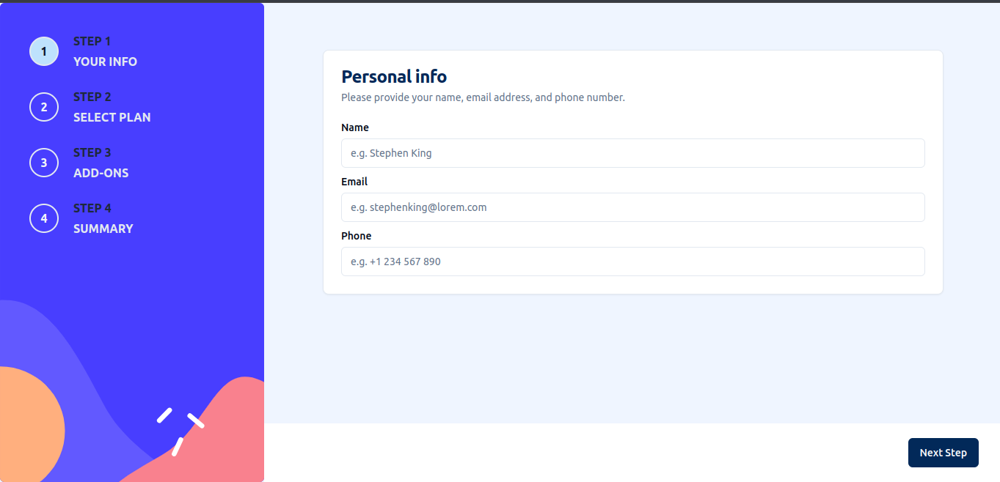
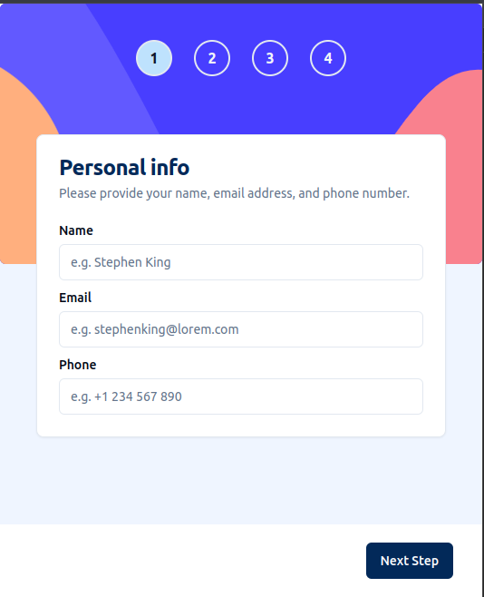

# Multi-step Form Challenge

This project is a solution to the Multi-step form challenge from [Frontend Mentor](https://www.frontendmentor.io/challenges/multistep-form-YVAnSdqQBJ). The goal of the challenge was to create a multi-step form with a clean and responsive design.

## Table of Contents

- [Demo](#demo)
- [Screenshots](#screenshots)
- [Technologies Used](#technologies-used)
- [Features](#features)
- [Installation](#installation)
- [Usage](#usage)
- [Contributing](#contributing)
- [License](#license)

## Demo

You can view the live demo of the Multi-step Form [here](https://frontendmentor-multi-step-form-phi.vercel.app/).

## Screenshots


_Desktop view of the multi-step form._


_Mobile view of the multi-step form._

## Technologies Used

- Nextjs
- Tailwind-css
- TypeScript
- Shadcn/ui
- React-hook-form
- Zod

## Features

- Multi-step form with a clean and intuitive design.
- Responsive layout for both desktop and mobile devices.
- Form validation to ensure user input is accurate.

## Installation

1. Clone the repository:

   ```bash
   git clone https://github.com/shamim-001/frontendmentor-multi-step-form
   ```

2. Navigate to the project directory:

   ```bash
   cd frontendmentor-multi-step-form
   ```

3. Install dependencies:

   ```bash
   npm install
   ```

4. Run the project on your local machine:

   ```bash
   npm run dev
   ```
